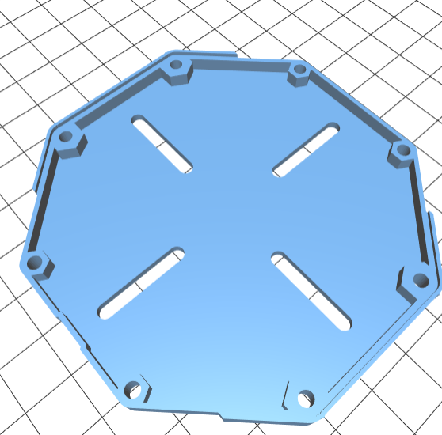
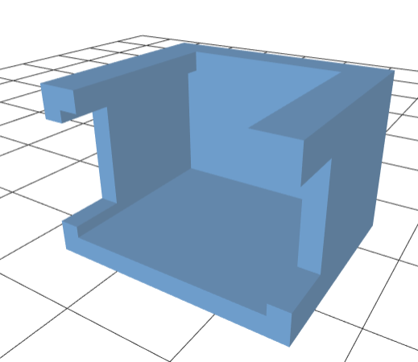

===============================
Mounting Plate and Switch Cover
===============================

The mounting plates make it easy to mount your RoverWing on the robot. We have
designed a number of mounting plates matching hole patterns of popular robotics
kits (Tetrix, RevRobotics, goBILDA) as well as a universal mounting plate. The
designs are provided as STL and STEP  files in  directory `Extras` of our
`github repository <https://github.com/roverwing/RoverWingHardware>`__; you can
download them and print on your own 3d printer. You can attach RoverWing to the
mounting plate using an M3 screw.

    Universal mounting plate for RoverWing

In the same directory, you can also find the 3d model of the switch cover for
use with the power switch included with RoverWing Top. Placing this cover over  switch
terminals helps protect them  from accidental contact with metal objects while
you are removing and putting on the RoverWing Top.

    Switch Cover
