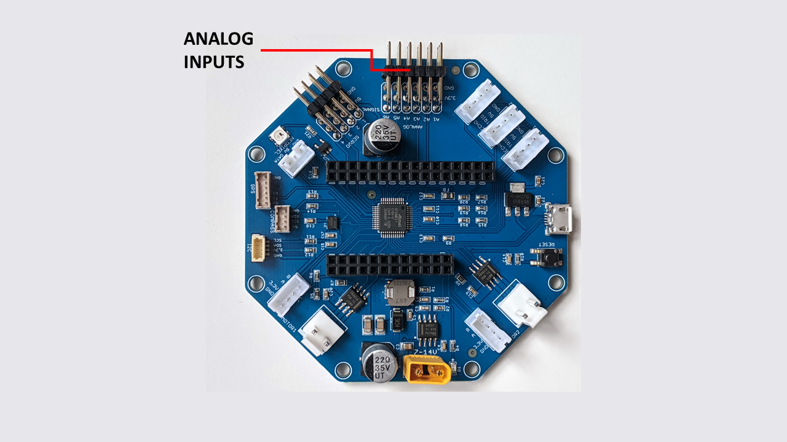

=============
Analog Inputs
=============

    RoverWing analog inputs

RoverWing provides connectors for 6 analog sensors, together with 3.3V power and
ground connectors, using a 10-bit analog-to-digital converter.
Note that the analog signal should not exceed 3.3V, otherwise
you might damage the board!

To filter out the noise, RoverWing firmware uses so-called
`low pass filter <https://en.wikipedia.org/wiki/Exponential_smoothing>`_;
slightly simplifying, one can say that it averages  several last readings
of each sensor. Raw values can also be accessed, for those
(uncommon) situations when it becomes necessary.
