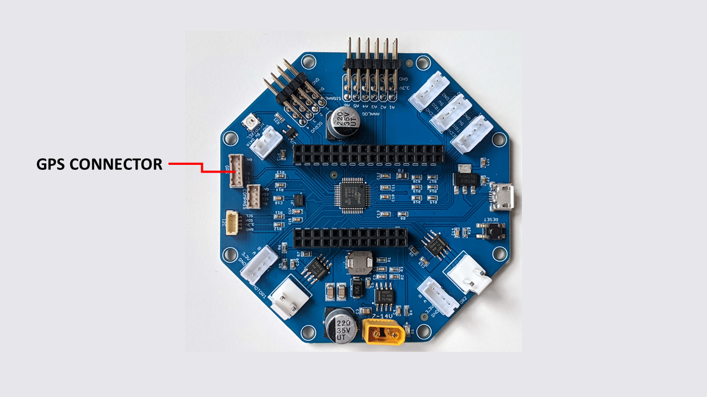

====
GPS
====

    RoverWing GPS connector

RoverWing provides a connector for an external GPS
sensor. It uses the same connector (Hirose DF13 6-pin) and pinout as the
popular `Pixhawk flight controller board <http://ardupilot.org/copter/docs/common-pixhawk-overview.html>`_  used in
quadcopters. Thus, you can use  any GPS  sensor which is
compatible with Pixhawk 2.4. Such sensors can be found on eBay or AliExpress for
as little as $20 (here is an
`example <https://www.aliexpress.com/item/Ublox-NEO-M8N-M8N-8N-High-Precision-GPS-Built-in-Compass-w-Stand-Holder-for-APM/32370714787.html>`__).

The provided firmware takes care of reading the GPS sensor,
providing an easy to use interface.

The board also provides a connector for the magnetometer (compass) sensor;
however, it is not supported by the current version of the firmware. We hope to
offer support for it with a future firmware update.
