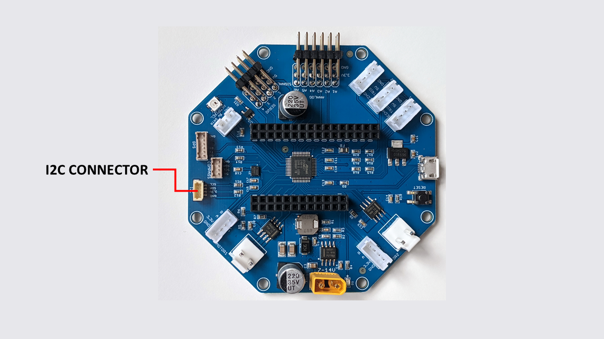

====================
I2C Port
====================

    RoverWing I2C  connector

RoverWing has a  port for connecting additional I2C devices. This port is
connected to the I2C bus of the Feather board and thus is controlled directly
by the Feather. The port uses JST SH4 connector, also known as Qwiic (SparkFun)
or Stemma QT (Adafurit). The  pin order  matches Qwiic/Stemma
QT pin order:

* GND
* 3.3V
* SDA
* SCL

This port is compatible with any 3.3V I2C device. See  :ref:`cables` section for
list of compatible cables.

RoverWing contains I2C bus pullup resistors (1.8K), so no additional pullups
are necessary.

.. note::
   If you need to connect more than one I2C device, you can use an I2C
   multiplexer such as `this one <https://learn.adafruit.com/adafruit-tca9548a-1-to-8-i2c-multiplexer-breakout>`__.
