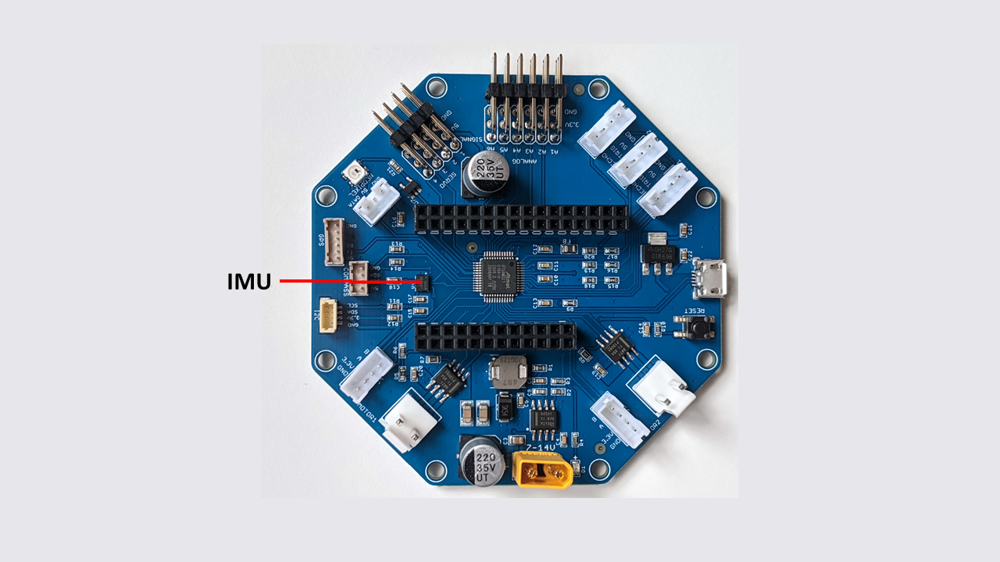

====================
Inertial Motion Unit
====================

RoverWing contains a  Inertial Motion Unit, based on
`ICM42605 <https://invensense.tdk.com/products/motion-tracking/6-axis/icm-42605/>`__
chip by Invensense. This is a 6 degree of freedom sensor (3 axis gyro and 3
axis accelerometer), which can be used for  determining robot orientation in
space. Provided firmware contains appropriate data fusion algorithm, combining
the sensor data and filtering out noise to return the robot orientation, either
as roll-pitch-yaw angles, or in a quaternion form. Please see |library-guide|
for details.

.. note::
   Even with noise filtering, data obtained from this sensor alone will always
   suffer from accumulating error (drift).
