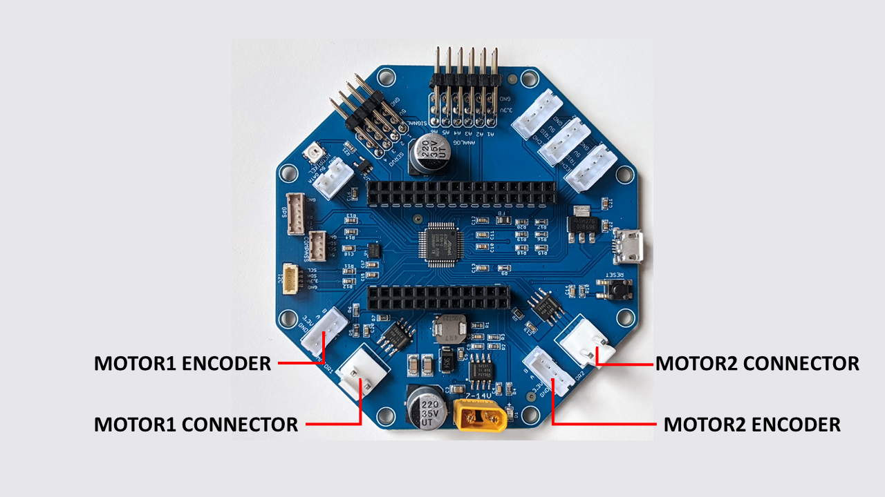

===================
Motors And Encoders
===================

    RoverWing motor connectors

The RoverWing provides connections for two brushed DC motors, at the same
voltage as the main power supply (7-14V). You can also use motors rated for
lower voltage and limit the power in software: for example, you can use 6V
motors with 7.4V power supply by limiting the maximal output power to 80%. Each
motor is controlled by `DRV8871 motor driver <https://www.ti.com/product/DRV8871>`__
by Texas Instruments, which can
provide up to 2.9A per motor. The drivers are current limited, so the current
will not exceed 2.9A even if the motor is stalled, which helps prevent driver
overheating.  The motor ports use JST VH connectors; see section
:ref:`cables` for list of compatible cables and adapters.

To avoid overheating, it is recommended to attach  additional heatsinks to the
motor drivers if you intend to run the motors at more than 1.5A continuous.

In addition, the RoverWing provides two ports for connecting quadrature
encoders, one for each motor. The encoder ports use
`JST PH4 <http://www.jst-mfg.com/product/detail_e.php?series=199>`__ connectors,
and pin order is  shown below:

* Ground (pin closest to board edge)
* 3.3V
* Channel A
* Channel B

These are the same connectors and pinouts as used
by `REV Robotics hubs <http://www.revrobotics.com/rev-31-1153/>`__, so one can
use the same encoder cables.  For other suggested cables, see :ref:`cables`
section.

.. warning::

   RoverWing provides 3.3V for the encoders. Some encoders require 5V or higher,
   so they won't work with RoverWing. Please check the specs of your encoders
   before starting your build!
