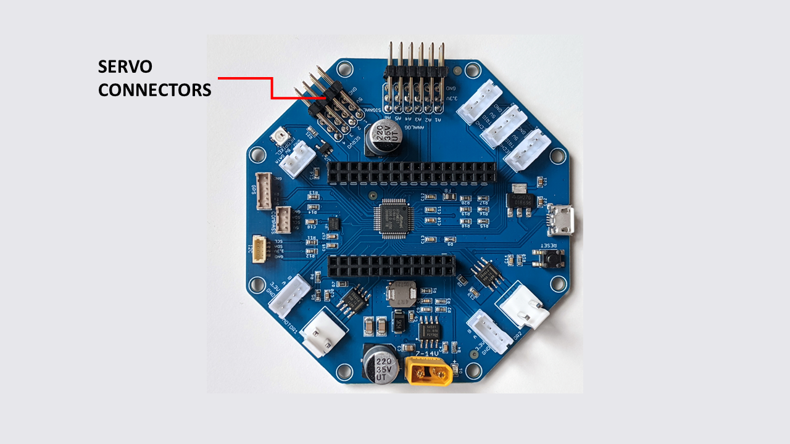

======
Servos
======

    RoverWing servo connectors

RoverWing provides four servo connections. They can be used for any hobby servo
which is controlled by standard PWM signal (500 μs - 2500 μs pulse duration) and
5V power.

.. note::
   The  total current available for servos and NeoPixel LEDs is about 3.5A.
   This is sufficient for most applications, but might not be enough for large
   loads.  For example, for a popular
   `HS485HB <https://hitecrcd.com/products/servos/sport-servos/analog-sport-servos/hs-485hb/product>`__
   standard size servo, no-load current draw is 0.3A, but the stall draw  can be
   as high as 1.2A. Note also that digital servos usually are much more
   power-hungry than analog servos.

   If you need more power for your servos, we recommend using
   `goBILDA Servo Power Node <https://www.gobilda.com/8-channel-servo-power-node/>`__.
