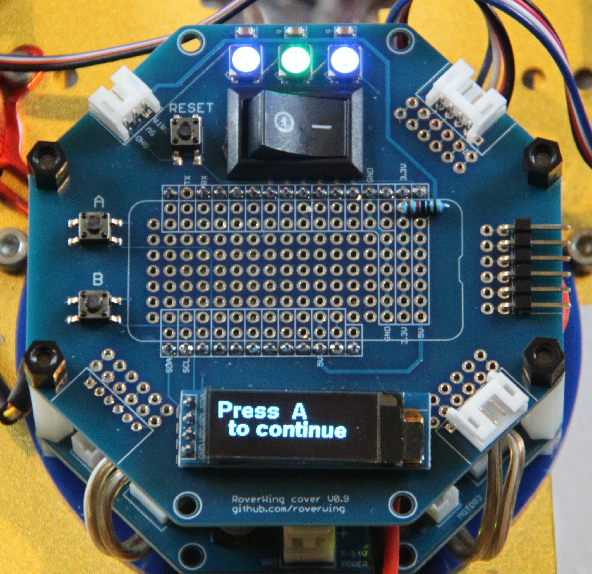

=============
RoverWing Top
=============

    RoverWing board with the top attached.

RoverWing top is an optional accessory for the RoverWing, which provides a
switch, small  prototyping area, three NeoPixel LEDs, buttons, and a 3 line
OLED display.  It is shown in the photo below.

If you ordered RoverWing Top as part of RoverWing  Kickstarter campaign, it
will need some assembly, requiring basic soldering skills. This is  documented
in detail in :ref:`top-build-guide`.

.. toctree::
    :caption: Table of Contents
    :maxdepth: 2

    top/features
    top/build-guide
