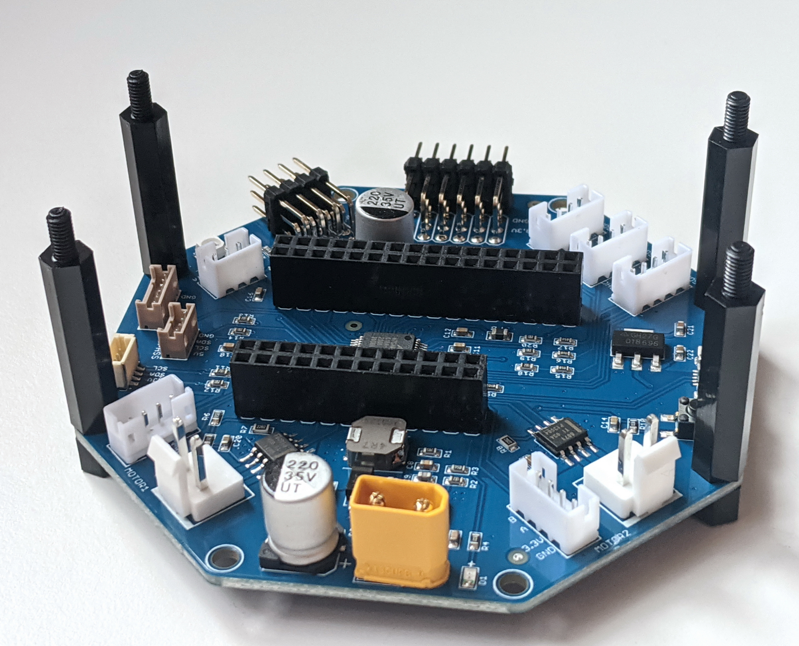
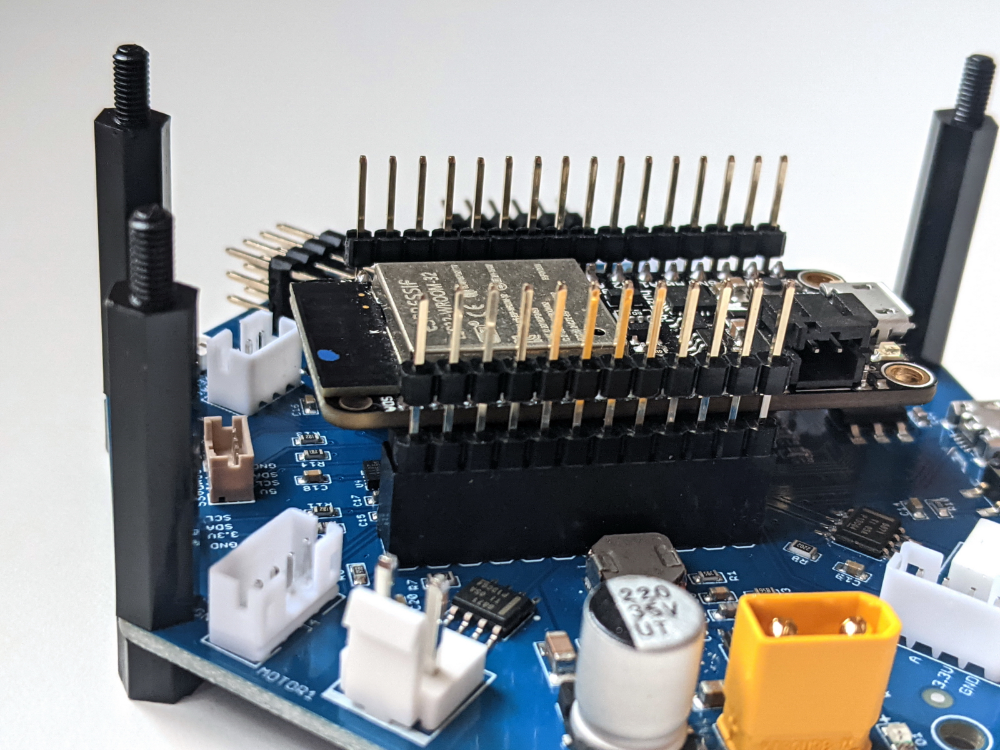
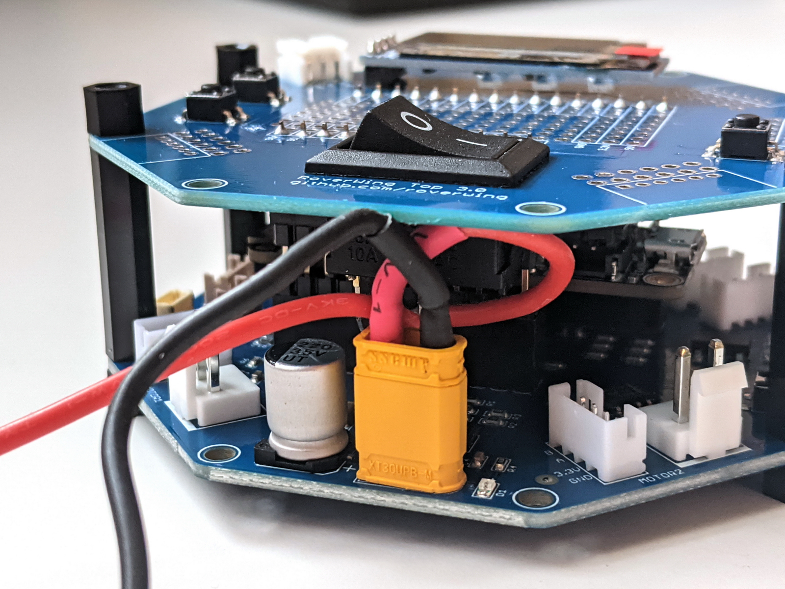

.. _top-build-guide:

===========================
RoverWing Top Assembly
===========================

Parts included
--------------

* RoverWing Top PCB with components soldered
* Switch and switch cover
* Male headers (21 mm), 12 pin and 16 pin
* Standoffs: four 25-mm m3 plastic standoffs, four 6mm m3 standoffs, nuts and
  screws

Assembly steps
--------------

.. warning::
   Before beginning the assembly process, disconnect the battery from the
   RoverWing. You should also disconnect the
   battery every time you are removing the RoverWing Top. Just turning the
   switch off is not enough!!

1. Take the XT30-XT60 power cable which comes with RoverWing and cut the **red**
   wire about 5cm (2in) away from the XT30 connector. Strip about 5mm (slightly
   less than 1/4") of wire on both sides of the cut.

2. Tightly twist the stripped wire, insert in the  holes in the switch terminals,
   and solder, as shown in the photo below. Please pay attention to details:
   which side of wire goes into each terminal and from which direction. Use
   diagonal cutters to cut away ends of the wire protruding from the terminal.

.. figure:: images/switch-solder.jpg
   :alt: Soldering power wires to the switch
   :width: 60%

   Soldering power wires to the switch

3. Feed the wires through the opening in RoverWing board and  insert the
   switch into the opening of the top as shown in the photo below. Pay attention
   to orientation of  the switch .

.. figure:: images/switch-inserted.jpg
   :alt: Inserting switch in top board
   :width: 60%

   Inserting the switch in the RoverWing top.

4. Attach the m3 standoffs to the RoverWing board.

   Attaching standoffs

5. Insert the long  male headers into the outer rows of female headers in the
   center of the RoverWing board

6. Plug  the Feather board into RoverWing;  reattach peripherals as necessary.

   RoverWing with Feather board and headers

7. Plug the XT30 end of the power cable into XT30 adapter on the RoverWing board.

8. Place the RoverWing Top on top of the Roverwing,  **making sure that the
   headers are properly aligned**.  You might need to slightly bend the wires coming
   out of the XT30 connector.

   Tighten the standoff nuts.

  Final assembly of the board and top

9. Double-check that the top board is correctly plugged into the headers.
   Reconnect the battery. If you haven't yet done so, remove the protective
   plastic sheet from the display, by pulling on red (or blue) tab.

To test the assembled board, run the :guilabel:`TopCover` example included
with the RoverWing Library (make sure to edit it to define the pins connected
to buttons -- this depends on the Feather board you use).
